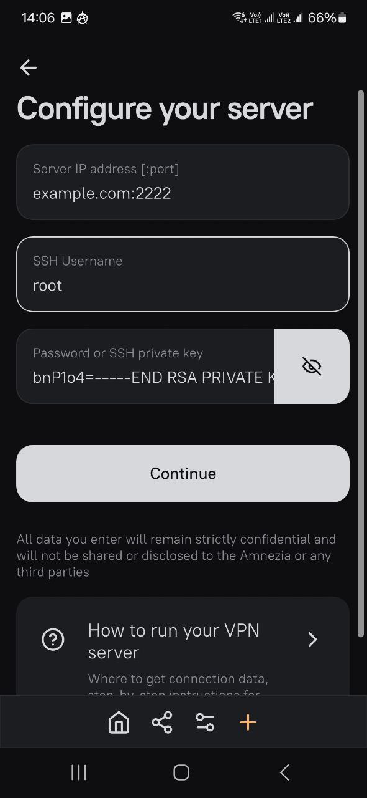
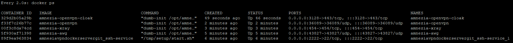

# Amnezia VPN Docker Server

[](https://hub.docker.com/r/nokitakaze/amnezia-vpn-server)
[](https://hub.docker.com/r/nokitakaze/amnezia-vpn-server)
[](https://hub.docker.com/r/nokitakaze/amnezia-vpn-server)

This is a docker image for the Amnezia VPN server.

The image uses the latest Ubuntu LTS at the moment — 24.04.

## Installation

1. Download the [Amnezia VPN client](https://amnezia.org/downloads), which will install all the necessary packages on the prepared
   server. This will be needed later.
2. Configure the host machine with Docker (including Docker
   Compose). [Official installation guides](https://docs.docker.com/engine/install/)
3. Create the future container

### Clean image build

Clone this git

```sh
git clone https://github.com/nokitakaze/AmneziaVPNDockerServer.git
cd AmneziaVPNDockerServer
docker-compose build
```

### As docker image

Your `docker-compose.yml`:

```yml
version: '3'
services:
  ssh-service:
    image: nokitakaze/amnezia-vpn-server
    ports:
      - "2222:22"
    volumes:
      - /var/run/docker.sock:/var/run/docker.sock  # Docker socket
      - ./authorized_keys:/root/.ssh/authorized_keys
      - ./ssh-keys:/etc/ssh/server-keys
```

Please note, **you only need to expose port 22**. All other ports on the host machine are forwarded by Amnezia VPN during setup on
the ports you specify within your client when setting up the server.

4. Create the `ssh-keys` folder. This folder is intended for the persistent storage of SSH keys for the new server.

```sh
mkdir ssh-keys
```

5. Create a pair of private and public SSH keys. I prefer to use the
   [Putty Key Generator tool](https://www.chiark.greenend.org.uk/~sgtatham/putty/latest.html)

Place your ssh public keys in the `authorized_keys` file.

Don't forget to export the private key in SSH format (`BEGIN RSA PRIVATE KEY`) without a password somewhere. It will be needed in
step 7.

6. Start your container

```sh
docker-compose up -d
```

Your container will automatically generate new keys for the SSH server. If you delete the keys from the ssh-keys folder, it will
create new ones when the container restarts.

7. Setting up a server

Now you can connect to your new server on port 2222.  
Connection -> Self-hosted VPN

Server IP address:
Your address with port. For example: `example.com:2222` or `192.168.148.8:12345`

SSH Username:
`root`

Password or SSH private key:  
Your private SSH key without a password, created in step 5.



8. Setting up protocols

Using the Amnezia VPN client, install all necessary protocols on your new server (the guest machine configured from this image).

Then, by using `docker ps`, you will be able to see all running sub-containers, including `amnezia-awg`, `amnezia-xray`, and
others.



Please note that **after restarting the guest machine, you will need to reinstall all protocols**.

## License

Licensed under the Apache License.

Please note that this container requires privileged access to Docker on your host machine via `/var/run/docker.sock`.

The author of this repository is not affiliated with or endorsed by the developers of Amnezia VPN. The software provided here
includes Amnezia VPN, which operates independently from this Docker image. The author has no control over the source code or
behavior of Amnezia VPN and is not responsible for any actions or outcomes that may result from its use.

**Disclaimer of Liability**: This Docker image is provided "AS IS" without any warranties, express or implied, and is intended for
use at the user's own risk. Users are strongly encouraged to perform their own security and functionality review of Amnezia VPN
before deployment. By using this software, you agree that the author of this repository shall not be held liable for any damages,
loss of data, or other harm arising from the use of Amnezia VPN or any other components contained within this image.

